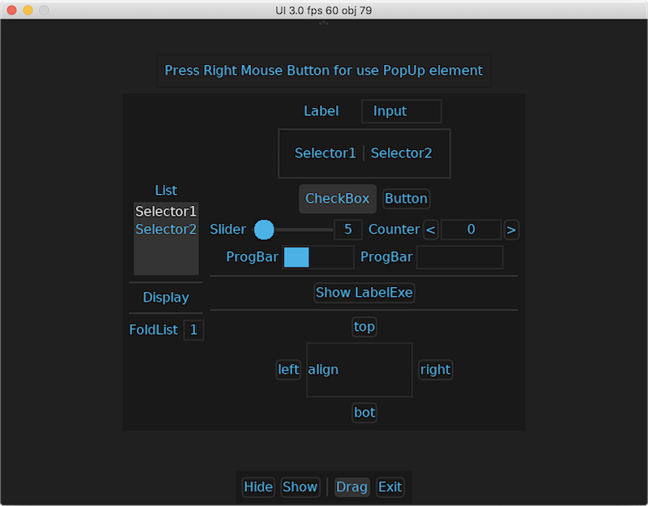

# Lovui

## v3.0

UI elements for LÖVE. ASCII-only UI.



### Usage

Install [LÖVE 11.5](https://love2d.org).

Copy `lovui.lua` into the project.

Call `ui.load()` from `love.load()` to connect Lovui with the LÖVE events system.

#### Minimal Example

`main.lua`
```lua
local ui = require('lovui')

io.stdout:setvbuf('no')

local MIDWID = love.graphics.getWidth() / 2
local MIDHEI = love.graphics.getHeight() / 2

function love.load()
    -- connect Lovui with the LÖVE events system
    ui.load()
    ui.Manager.clear()
    local lab = ui.Label{
        x=MIDWID, y=MIDHEI, anchor='s', text='Hello World!'
    }
    ui.Button{
        x=MIDWID,
        y=MIDHEI,
        anchor='n',
        text=' OK ',
        com=function(self) lab.text=self.text end
    }
end

function love.update(dt) ui.Manager.update(dt) end
function love.draw() ui.Manager.draw() end

-- Lovui uses the LÖVE input events.
-- Define all of these functions even if they are empty.
function love.textinput(t) end
function love.keypressed(key,unicode,isrepeat)end
function love.keyreleased(key,unicode) end
function love.mousepressed(x,y,button,istouch) end
function love.mousereleased(x,y,button,istouch) end
function love.mousemoved(x,y,dx,dy,istouch) end
function love.wheelmoved(x, y) end
```

#### Layout Example

`main.lua`
```lua
local ui = require('lovui')

io.stdout:setvbuf('no')

-- variables for UI elements
local countUI = {val=' '}
local countFPS = {val=' '}

function love.load()
    ui.load()
    ui.Manager.clear()

    local menu = ui.VBox{
        x=love.graphics.getWidth() / 2,
        y=love.graphics.getHeight() / 2,
        frm=8,
        mode='fill'
    }
    local left = ui.HBox()
    local right = ui.HBox()
    left:add(
        ui.Label{text='UI  '},
        ui.Sep(),
        ui.Label{text='000', var=countUI}
    )
    right:add(
        ui.Label{text='FPS'},
        ui.Sep(),
        ui.Label{text='000', var=countFPS}
    )

    menu:add(
        left, ui.Sep(), right, ui.Button{
            text='Clear',com=function() ui.Manager.clear() end
        }
    )
end

function love.update(dt)
    countUI.val = ui.Manager.len()
    countFPS.val = love.timer.getFPS()
    ui.Manager.update(dt)
end

function love.draw() ui.Manager.draw() end

function love.textinput(t) end
function love.keypressed(key,unicode,isrepeat)end
function love.keyreleased(key,unicode) end
function love.mousepressed(x,y,button,istouch) end
function love.mousereleased(x,y,button,istouch) end
function love.mousemoved(x,y,dx,dy,istouch) end
function love.wheelmoved(x, y) end
```

#### Complete Example

Advanced project in the `example/` directory.

### API Reference

#### ui.load()

`ui.load()` connects Lovui with the LÖVE events system.

Call it once from `love.load()` to connect Lovui with the LÖVE events system.

#### ui.Manager

`ui.Manager.items` - holds all UI elements.

`ui.Manager.add()` - adds a UI element to the manager. Usually UI elements add themselves automatically.

`ui.Manager.clear()` - removes all UI elements.

`ui.Manager.remove(item)` - removes a UI element.

`ui.Manager.len()` - returns the number of UI elements.

`ui.Manager.focus(bool)` - sets or removes focus for UI elements.

`ui.Manager.draw()` - draws all UI elements.

`ui.Manager.update(dt)` - updates all UI elements.

Typical usage includes `ui.Manager.draw()`, `ui.Manager.update(dt)`, and `ui.Manager.clear()`.

#### UI elements

`ui.HBox` - horizontal container for a group of UI elements, default transparent.

`ui.VBox` - vertical container for a group of UI elements, default transparent.

`ui.Sep` - small separator without HBox and VBox. When added to `ui.HBox` or `ui.VBox`, `ui.Sep` becomes a horizontal or vertical line.

`ui.PopUp` - vertical pop-up container for a group of UI elements.

`ui.Label` - simple text element, default transparent background without a frame.

`ui.Input` - element for ASCII-only text input.

`ui.CheckBox` - true/false element.

`ui.LabelExe` - shows a label and runs a given function before disappearing.

`ui.Button` - press to run a given function.

`ui.Selector` - aka "radiobutton".

`ui.Counter` - two `ui.Button`s and a `ui.Label` to count from `min` to `max` with a given `step`.

`ui.Slider` - drag handle to change a variable value.

`ui.ProgBar` - shows a variable value with a rectangle bar or ASCII characters.

`ui.List` - group of `ui.Selector`s with a label.

`ui.FoldList` - group of pop-up `ui.Selector`s with a label.

#### Images

Use `ImageData` to provide images for UI elements.

#### Colors

Frame color `frmclr` and font color `fntclr` can be provided for UI elements.

Lovui automatically calculates the font highlight color `onclr` and frame highlight color `onfrm`.

For example, `fntclr={1,1,1,1}` for `ui.Button` produces white text and the same highlight color.

With `fntclr={0.3,0.3,0.3,1}`, the `ui.Button` text becomes brighter when the mouse is over the element.

#### External variables

UI elements can use external variables through the `var` field.

`ui.CheckBox` uses a table with a `bool` field.

```lua
local checkBoxVar = {bool=false}
```

Other UI elements that use `var` use a table with a `val` field.

```lua
local selectorVar = {val='Selector1'}
```

### Credits

Design/Art/Code: [Aliaksandr Veledzimovich](https://twitter.com/veledzimovich)
Engine: [LÖVE](https://love2d.org/) [License](https://github.com/love2d/love/blob/main/license.txt)
