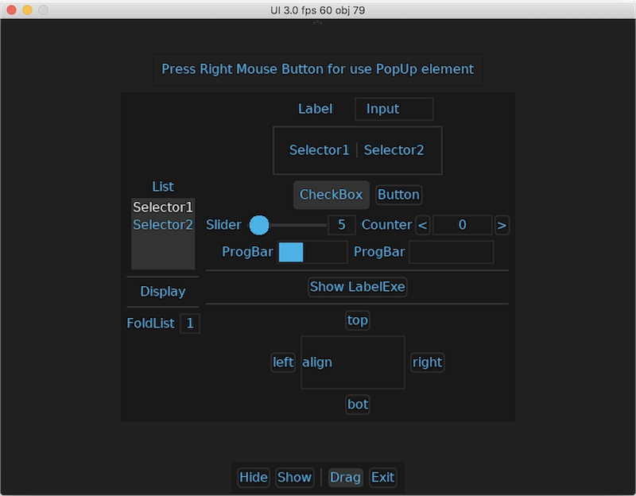

# LOVUI-LÖVE

UI elements for Love2d. ASCII-only.



Copy lovui.lua to the project folder.

Import module.

``` lua
local ui = require('lovui')
```

"Hello World!".

``` lua
local ui = require('lovui')
local MIDWID = love.graphics.getWidth() / 2
local MIDHEI = love.graphics.getHeight() / 2
function love.load()
    -- connect lovui with love events system
    ui.init()
    ui.Manager.clear()
    local lab = ui.Label{x=MIDWID, y=MIDHEI,anchor='s', text='Hello World!'}
    ui.Button{x=MIDWID, y=MIDHEI, anchor='n', text=' OK ',
                com=function(self) lab.text=self.text end}
end

function love.update(dt) ui.Manager.update(dt) end
function love.draw() ui.Manager.draw() end

-- lovui need all this functions
function love.textinput(t) end
function love.keypressed(key,unicode,isrepeat)end
function love.keyreleased(key,unicode) end
function love.mousepressed(x,y,button,istouch) end
function love.mousereleased(x,y,button,istouch) end
function love.mousemoved(x,y,dx,dy,istouch) end
function love.wheelmoved(x, y) end
```

Example with ui.HBox ui.VBox and ui.Sep.

``` lua
local ui = require('lovui')
-- variables for UI elements
local countUI = {val=' '}
local countFPS = {val=' '}
function love.load()
    ui.init()
    ui.Manager.clear()

    local menu = ui.VBox{x=love.graphics.getWidth() / 2,
                        y=love.graphics.getHeight() / 2,frm=8,mode='fill'}
    local left = ui.HBox()
    local right = ui.HBox()
    left:add(ui.Label{text='UI  '},ui.Sep(),ui.Label{text='000',var=countUI})
    right:add(ui.Label{text='FPS'},ui.Sep(),ui.Label{text='000',var=countFPS})

    menu:add(left,ui.Sep(),right,
             ui.Button{text='Clear',com=function() ui.Manager.clear() end})
end

function love.update(dt)
    countUI.val = ui.Manager.len()
    countFPS.val = love.timer.getFPS()
    ui.Manager.update(dt)
end

function love.draw() ui.Manager.draw() end

function love.textinput(t) end
function love.keypressed(key,unicode,isrepeat)end
function love.keyreleased(key,unicode) end
function love.mousepressed(x,y,button,istouch) end
function love.mousereleased(x,y,button,istouch) end
function love.mousemoved(x,y,dx,dy,istouch) end
function love.wheelmoved(x, y) end
```

Look at advanced examples in main.lua.

To run example: clone repository, download & install [LÖVE 11.1](https://love2d.org) for you system and run main.lua.


# ui.init()

ui.init() - connect lovui with love events system.

# ui.Manager

ui.items - hold all UI elements.

ui.Manager.add() - don't add items by yourself.

ui.Manager.clear() - remove all UI elements.

ui.Manager.remove(item) - remove UI element.

ui.Manager.len() - count all UI elements

ui.Manager.focus(bool) - set or remove focus for UI element.

ui.Manager.draw()

ui.Manager.update(dt)

Usually your use ui.Manager.draw(), ui.Manager.update(dt) and ui.Manager.clear()

# UI elements

ui.HBox - horizontal container for group of UI elements, default transparent.

ui.VBox - vertical container for group of UI elements, default transparent.

ui.Sep - small dot without HBox and VBox. When add ui.Sep to ui.HBox or ui.VBox, ui.Sep become horizontal/vertical line.

ui.PopUp - vertical pop-up container for group of UI elements.

ui.Label - simple text element, default transparent background without frame.

ui.Input - element for input ASCII-only text.

ui.CheckBox - true/false element.

ui.LabelExe - show label and run given function before disappear.

ui.Button - press to run given function.

ui.Selector - aka 'radiobutton'.

ui.Counter - two ui.Buttons and ui.Label to count from min to max with given step.

ui.Slider - drag handle to change variable value.

ui.ProgBar - show variable value with rectangle bar or with ASCII.

ui.List - group of ui.Selectors with label.

ui.FoldList - group of pop-up ui.Selectors with label.

# Colors

You can provide frame color (frmclr) and font color (fntclr) for UI elements. But for font highlight color (onclr) and frame highlight color (onfrm), lovui count automatically.

For example, if you choose fntclr={1,1,1,1} for ui.Button you get white font and same highlight color, but if you choose fntclr={0.3,0.3,0.3,1}, ui.Button text become brighter when mouse collide with element.

# External variables

Provide custom variables for field 'var' when setup UI elements.

ui.CheckBcox.
``` lua
local checkBoxVar = {bool=false}
```
Other UI elements.
``` lua
local selectorVar = {val='Selector1'}
```

